# Fusion Complexity Inversion: Why Simpler Cross-View Modules Outperform SSMs and Cross-View Attention Transformers for Pasture Biomass Regression:

**Author:** Mridankan Mandal

**Paper:** [arXiv:2603.07819](https://arxiv.org/abs/2603.07819)

### The Pre-Trained Models (bundled as series A, B, E1 and E2 based on the results of the research work):

- Series A: https://www.kaggle.com/models/redzapdos123/a-series-biomass-models
- Series B: https://www.kaggle.com/models/redzapdos123/b-series-biomass-models
- Series E1: https://www.kaggle.com/models/redzapdos123/e-series-biomass-models-1
- Series E2: https://www.kaggle.com/models/redzapdos123/e-series-biomass-models-2

---

## Overview:

Accurate estimation of pasture biomass from agricultural imagery is critical for sustainable livestock management. This repository provides the complete source code, experiment configurations, and Kaggle notebooks for the Fusion Complexity Inversion study conducted on the CSIRO Pasture Biomass benchmark.

The study systematically evaluates adaptation of vision foundation models to agricultural regression through 17 configurations spanning four backbones (EfficientNet-B3 to DINOv3-ViT-L), five cross-view fusion mechanisms, and a 4x2 metadata factorial.

A counterintuitive principle, termed **Fusion Complexity Inversion**, is uncovered: on scarce agricultural data, a two-layer gated depthwise convolution (R² = 0.903) outperforms cross-view attention transformers (0.833), bidirectional SSMs (0.819), and full Mamba (0.793, which falls below the no-fusion baseline).

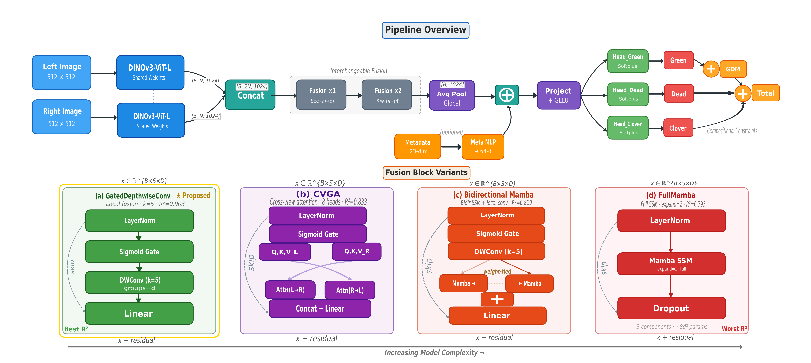

---

## Key Findings:

- **Backbone pretraining scale monotonically dominates** all architectural choices. The DINOv2 to DINOv3 upgrade alone yields +5.0 R² points.
- **Simple local fusion outperforms complex global fusion.** A two-layer GatedDepthwiseConvBlock achieves the best performance among all tested fusion mechanisms.
- **Metadata creates a universal ceiling** at R² approximately 0.829. Adding metadata features (species, state, and NDVI) collapses an 8.4-point fusion spread to 0.1 points.
- **Actionable guidelines for sparse agricultural benchmarks** are established: backbone quality should be prioritized over fusion complexity, local modules are preferred over global alternatives, and features unavailable at inference time should be excluded.

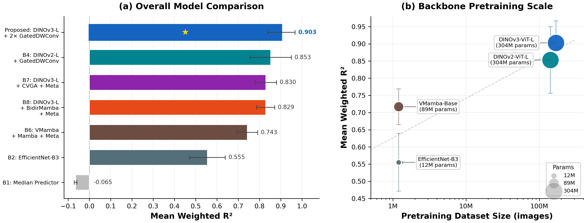

---

## Directory Structure:

```
FusionComplexityInversionBiomass/
├── README.md                       # This file.
├── Usage.md                        # Detailed execution instructions.
├── CodeBaseIndex.md                # File-level index of the entire codebase.
├── LICENSE                         # CC BY-NC-SA 4.0 license.
├── .gitignore                      # Git exclusion rules.
├── img/                            # Paper figures and visualizations.
│   ├── fig_architecture.png
│   ├── fig_main_results.png
│   ├── fig_ablation_studies.png
│   └── ... (13 figures total)
├── src/                            # Core source code.
│   ├── engine.py                   # Shared training engine.
│   ├── models.py                   # All model architectures.
│   └── utils/
│       ├── count_params.py         # Parameter counting utility.
│       └── setup_deps.sh           # One-time dependency setup script.
├── analysis/                       # Dataset analysis and visualization scripts.
│   ├── dataset_analysis*.py        # Exploratory Data Analysis (EDA) scripts.
│   ├── generate_tsne_figure.py     # Feature space t-SNE visualizations.
│   └── generate_paper_figures.py   # Scripts to generate paper figures.
├── experiments/                    # Experiment configuration scripts.
│   ├── baselines/                  # B1-B6 baseline configurations.
│   ├── ablation/                   # E1-E8 and A1-A6 ablation studies.
│   └── proposed/                   # Proposed model configurations.
└── notebooks/                      # Kaggle notebook versions.
    ├── training/                   # 5-fold CV training notebooks.
    │   ├── baselines/
    │   └── ablation/
    └── submission/                 # Inference and submission notebooks.
        ├── baselines/
        ├── ablation/
        └── proposed/
```

---

## Experiments:

### Baselines (B1-B6):

| ID | Model | Description |
|----|-------|-------------|
| B1 | Median Predictor | Statistical lower bound with no learned parameters. |
| B2 | EfficientNet-B3 | CNN baseline using timm pretrained weights. |
| B3 | DINOv2-Giant | Zero-shot feature probing. |
| B4 | DINOv2-Large + Fusion | ViT-L backbone with GatedDepthwiseConv fusion. |
| B5 | DINOv3-ViT-L + Fusion | Updated Meta ViT-L with GatedDepthwiseConv fusion. |
| B6 | VMamba-Base + Mamba SSM | VMamba-Base v2 SSM backbone with Mamba SSM fusion. |

### Proposed Model Configurations:

| ID | Model | Description |
|----|-------|-------------|
| Proposed_BabyMamba | DINOv3-ViT-L + BidirMamba | DINOv3-ViT-L backbone with weight-tied bidirectional Mamba SSM fusion. |
| Proposed_CVGA | DINOv3-ViT-L + CVGA | DINOv3-ViT-L backbone with Cross-View Gated Attention fusion. |

### Ablation Studies (E1-E8):

These experiments systematically isolate the effect of each fusion mechanism and metadata on DINOv3-ViT-L.

| ID | Study | Description |
|----|-------|-------------|
| E1 | BabyMamba (no metadata) | Bidirectional Mamba SSM fusion without metadata features. |
| E2 | CVGA (no metadata) | Cross-View Gated Attention fusion without metadata features. |
| E3 | GatedDWConv (with metadata) | Gated depthwise convolution fusion with metadata injection. |
| E4 | No Fusion | Mean pooling of concatenated features, that is, no fusion module. |
| E5 | Full Mamba (no metadata) | Full-scale Mamba SSM fusion without metadata features. |
| E6 | Single Block | Single fusion block instead of the default two blocks. |
| E7 | Quad Block | Four fusion blocks instead of the default two blocks. |
| E8 | No Fusion (with metadata) | Mean pooling with metadata features injected. |

### Ablation Studies (A1-A6):

These experiments evaluate backbone, training, and augmentation choices using VMamba-Base.

| ID | Study | Description |
|----|-------|-------------|
| A1 | SSM Scale | Compares VMamba-Tiny, VMamba-Small, and VMamba-Base backbone scales. |
| A2 | Metadata | Model accuracy with and without metadata feature injection. |
| A3 | Cross-Validation | Standard KFold compared with site-stratified group splits. |
| A4 | Loss Function | MSE loss compared with Huber (SmoothL1) loss. |
| A5 | TTA | Test-time augmentation impact on spatial resilience. |
| A6 | VMamba vs DINOv2 | SSM linear scanning compared with ViT quadratic attention. |

---

## Cross-Validation Strategy:

All experiments use **Stratified Group 5-Fold CV** through `sklearn.model_selection.StratifiedGroupKFold`.

- **Stratification:** Samples are binned into 5 quantiles by `Dry_Total_g` for balanced target distribution.
- **Grouping:** Grouped by `image_id` to prevent data leakage between dual-view pairs.
- **Seed:** Deterministic seed of 17 for reproducibility.

---

## Dataset:

The CSIRO Pasture Biomass benchmark is a 357-image dual-view dataset with laboratory-validated, component-wise ground truth for five biomass targets.

The dataset is available through the [CSIRO Image2Biomass Kaggle competition](https://www.kaggle.com/competitions/csiro-image2biomass). It should be placed in a `csiro-biomass/` directory adjacent to this repository.

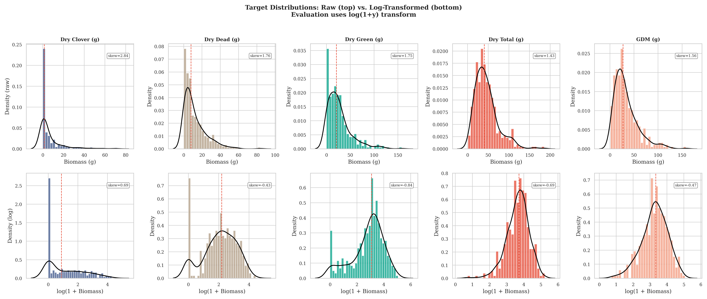

---

## Visualizations:

### Correlation Heatmap:

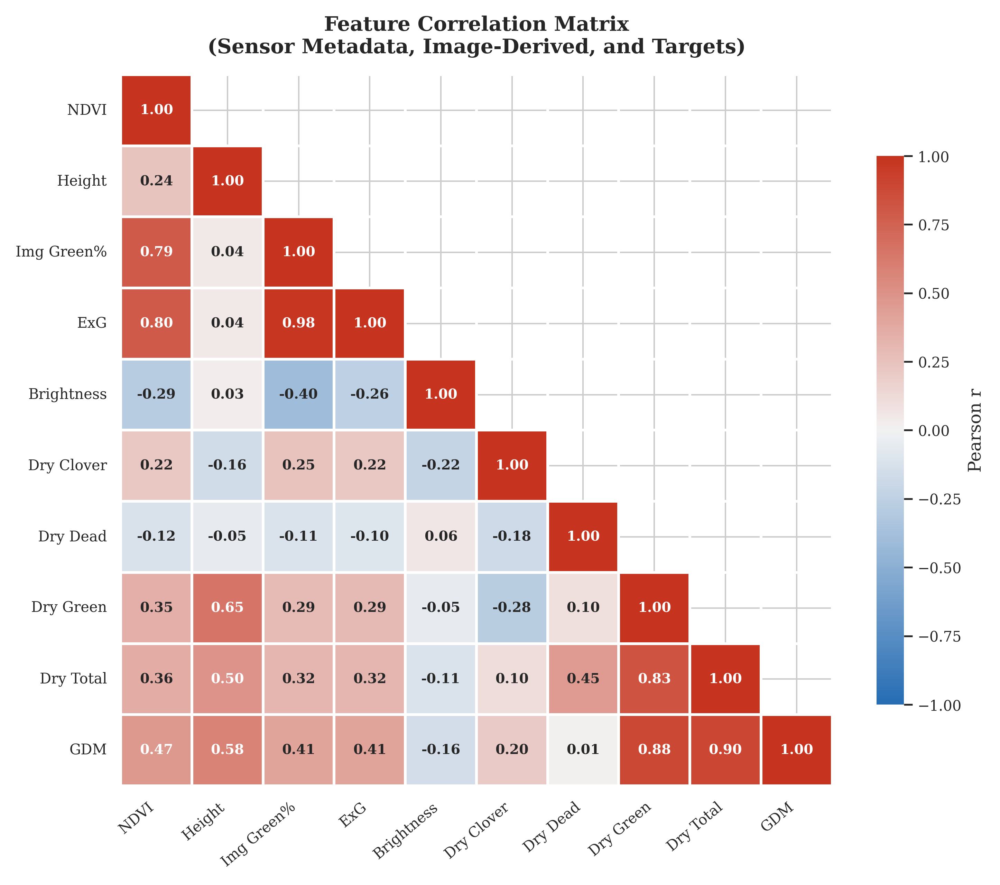

### NDVI, Height, and Biomass Relationships:

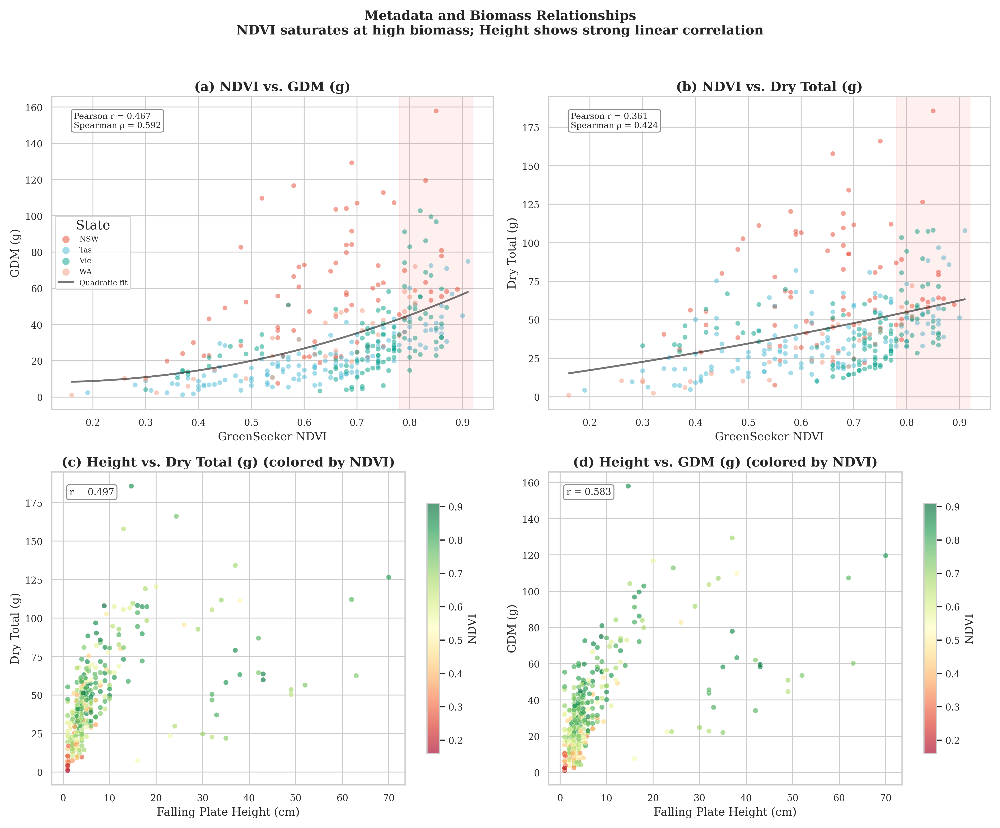

### Biomass by State:

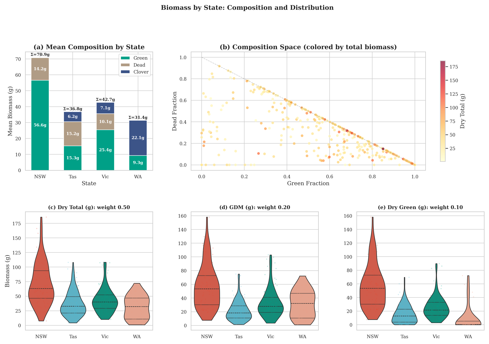

### Seasonal Dynamics:

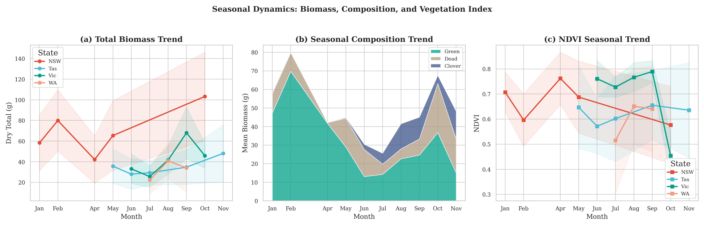

### Species Analysis:

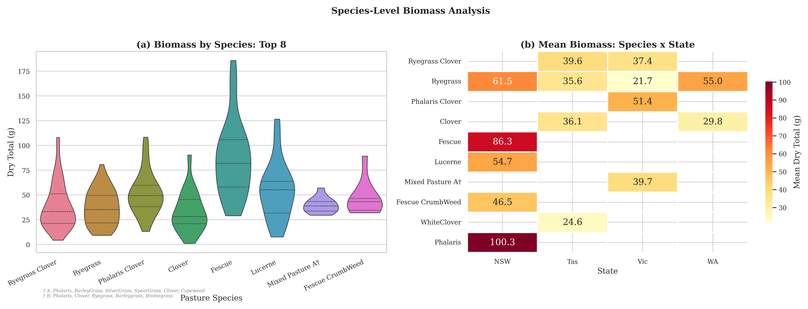

### Feature Space Analysis:

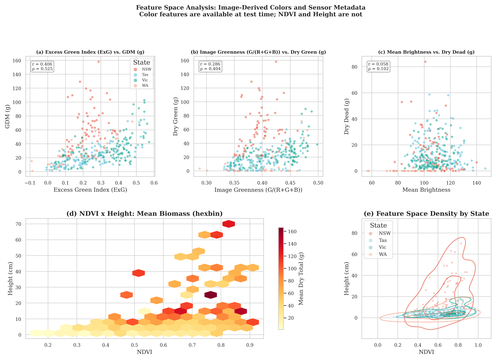

### Evaluation Quality:

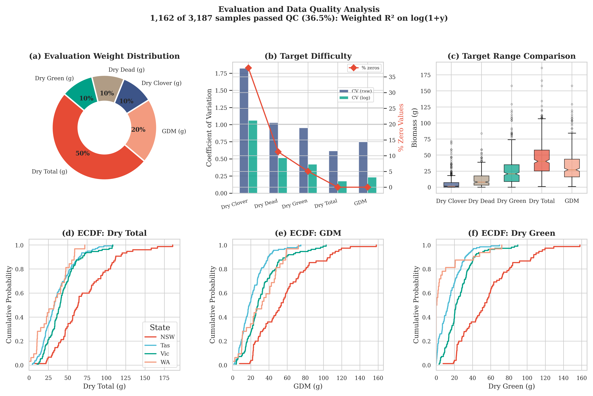

### Backbone Feature Maps:

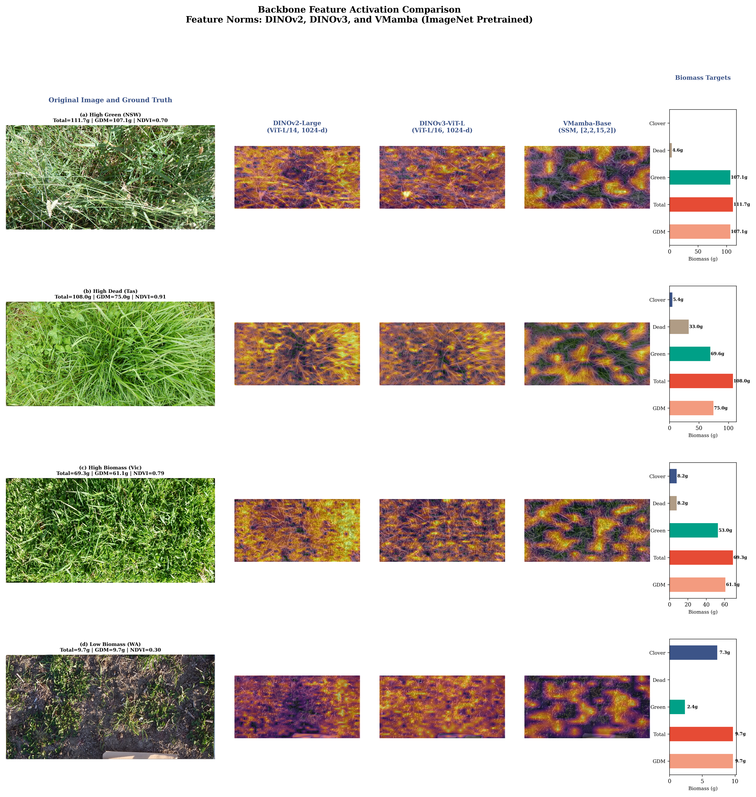

### Ablation Studies Results:

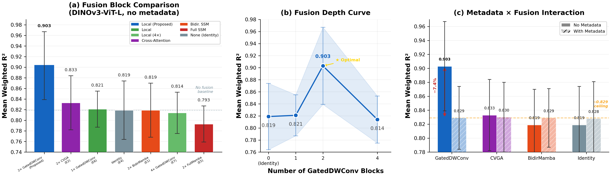

### Fold Analysis:

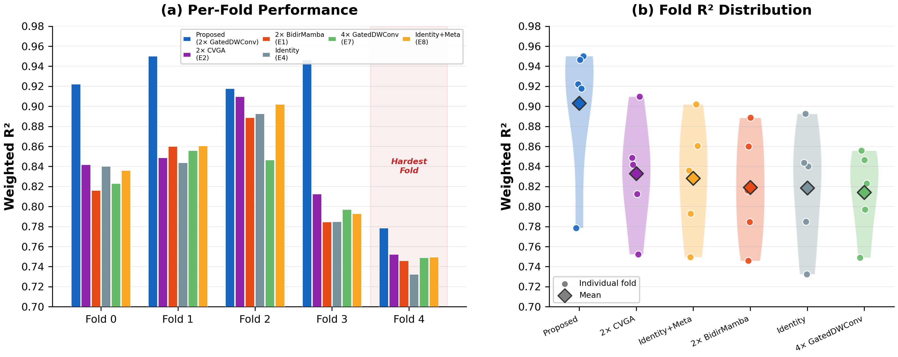

---

## Prerequisites:

### Kaggle Execution:
- GPU-enabled kernel with Internet access for model downloads.
- CSIRO Image2Biomass competition dataset attached.

### Local Execution (WSL + conda):
- WSL Ubuntu with conda environment `mambahar` (Python 3.11, and PyTorch 2.5.1+cu121).
- NVIDIA GPU with CUDA support (tested on RTX 4060 Laptop with 8 GB VRAM).
- Required packages: `mamba_ssm`, `timm`, `scikit-learn`, `pandas`, `albumentations`, and `tqdm`.
- Run `src/utils/setup_deps.sh` once to install VMamba and download pretrained weights.

See [Usage.md](Usage.md) for detailed execution instructions.

---

## Training Configuration:

All experiments enforce the following default training configuration.

- Seed: 17.
- Maximum epochs: 50.
- Early stopping patience: 10.
- Mixed precision: fp16 through `torch.amp.autocast`.
- Optimizer: AdamW with differential learning rates (backbone 1e-5, and head 5e-4).
- Scheduler: Cosine annealing with linear warmup (5 epochs).
- VMamba-based models use gradient checkpointing and gradient accumulation (effective batch size 8) to fit within 8 GB VRAM.

---

## Citation:

```bibtex
@article{mandal2026fusioncomplexityinversion,
  title={Fusion Complexity Inversion: Why Simpler Cross-View Modules Outperform SSMs and Cross-View Attention Transformers for Pasture Biomass Regression},
  author={Mandal, Mridankan},
  journal={arXiv preprint arXiv:2603.07819},
  year={2026}
}
```

---

## License:

This work is licensed under a [Creative Commons Attribution-NonCommercial-ShareAlike 4.0 International License](https://creativecommons.org/licenses/by-nc-sa/4.0/).
